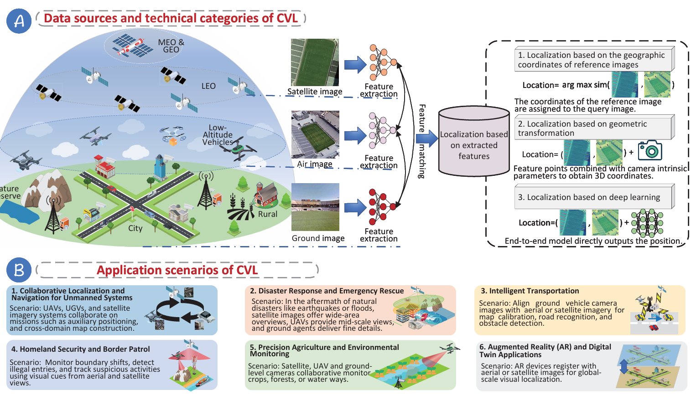
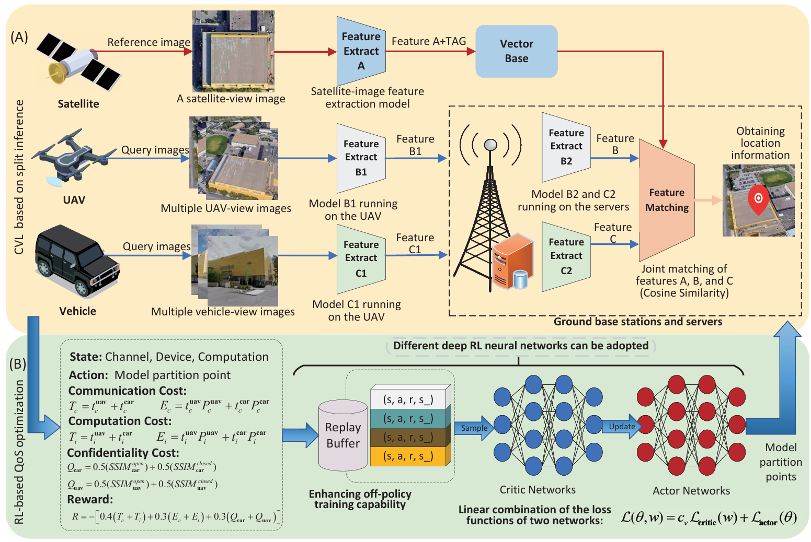
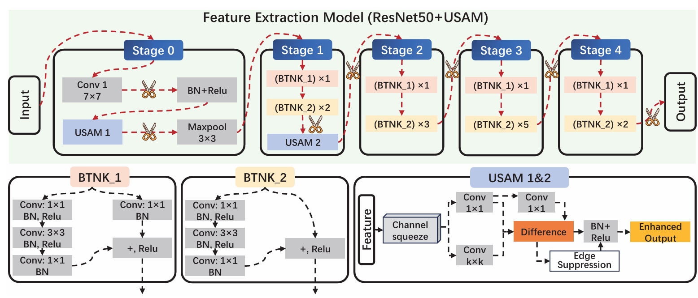
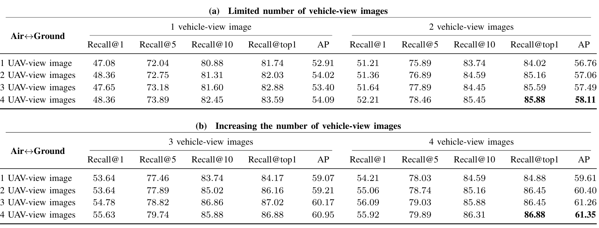
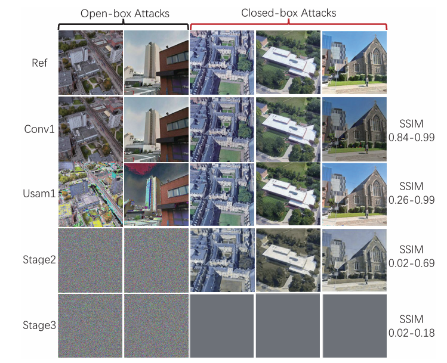
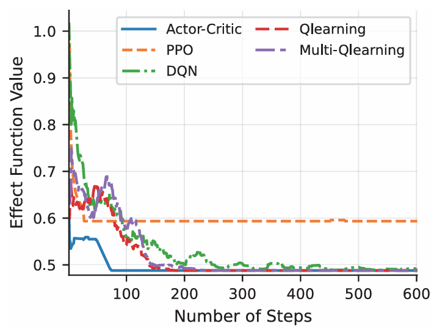

# cross_view_model
it can line with three view image include drone 、street and satellite

This repository provides the code for " Efficient Cross-View Localization in 6G Space-Air-Ground Integrated Networks"

Recently, visual localization has become an important supplement to improve localization reliability, and cross-view approaches can greatly enhance coverage and adaptability. Mean time, future 6G will enable a globally covered mobile communication system, with space-air-ground integrated networks (SAGIN) serving as key supporting architecture. Inspired by this, we explores the integration of cross-view localization (CVL) with 6G SAGIN, focusing on embedding CVL into the 6G SAGIN architecture and enhancing its performance in terms of latency, energy consumption, and privacy protection. 

As illustrated in the figure, we provide an overview of multi-source data fusion and technical classifications for CVL, while visually presenting its application scenarios across six major domains, including unmanned systems, intelligent transportation, and emergency rescue.

Furthermore, to address the high computational and energy demands of CVL models on edge devices, we propose a split inference architecture for cross-view localization (as shown in the figure) and highlight a technical scheme that utilizes reinforcement learning (RL) to achieve Quality of Service (QoS) optimization by balancing computation, communication, and confidentiality costs.

# Dataset
The dataset we used is [university-1652](https://github.com/layumi/University1652-Baseline), please replace it with your own dataset path when using. We adopt ResNet-50 as the backbone feature extraction model, with two unified spatial attention modules (USAM) incorporated to enhance feature matching performance. The internal structureof the feature extractionmodel as follows.

# Requirement
The following are just some key points, and the rest can be found in detail in requirement.txt.

Python 3.9

GPU Memory >= 8G

Numpy > 1.12.1

Pytorch 0.3+

scipy == 1.2.1

# Evaluation

## 1. Cross-View Reasoning
Before running the evaluation, please replace the dataset paths and pre-trained model weight paths with your own local paths. 

Due to the large file size, the model weights cannot be uploaded to GitHub. You can download them from my [Google Drive](https://drive.google.com/drive/folders/1cbC_aw71noqhKzk86_kl2NGvMHTzcRZ7?usp=sharing), where we provide two weight files: `pytorch_result.mat` and `net_751.pth`. This experiment specifically utilizes the pre-trained weights `net_751.pth` and `opts.yaml`. 

If you wish to test cross-view reasoning with your own trained weights, please refer to the [RK-Net repository](https://github.com/AggMan96/RK-Net) or stay tuned for our future updates, as we plan to open-source more cross-view training models and results on GitHub. Thank you for your interest.

### Experiment I: Performance Evaluation
The feasibility and localization performance of UAVs or vehicles using CVL based on 6G Space-Air-Ground Integrated Networks (SAGIN) are evaluated through simulation experiments. The experiment is configured with varying numbers and viewpoints of images to assess matching accuracy. Result is shown below:

---

### Experiment II: Privacy Breach Assessment
We utilize both whitebox and blackbox attacks to evaluate potential privacy leaks, demonstrating the degree of privacy breach at multiple nodes within the model. The Structural Similarity Index Measure (SSIM) is employed to quantify the level of privacy leakage. The visualization of the attack effects is shown below:

---

## 3. Reinforcement Learning (RL)
A joint optimization problem for communication, computation, and confidentiality within the QoS metrics of CVL is formulated. This optimization problem is solved using a range of RL algorithms, including **Actor-Critic, PPO, DQN, Q-learning, and Multi-Q-learning**, to compare their convergence performance.

Please explore the implementation in the `magazine_RL` folder. The experimental results are displayed below:

# welcome to cite our work

