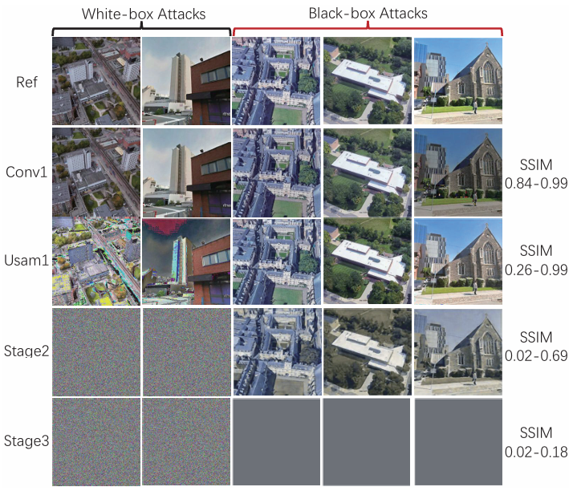

# cross_view_model
it can line with three view image include drone 、street and satellite

This repository provides the code for " Efficient Cross-View Localization in 6G Space-Air-Ground Integrated Networks"

Recently, visual localization has become an important supplement to improve localization reliability, and cross-view approaches can greatly enhance coverage and adaptability. Mean time, future 6G will enable a globally covered mobile communication system, with space-air-ground integrated networks (SAGIN) serving as key supporting architecture. Inspired by this, we explores the integration of cross-view localization (CVL) with 6G SAGIN, focusing on embedding CVL into the 6G SAGIN architecture and enhancing its performance in terms of latency, energy consumption, and privacy protection. 

# Dataset
The dataset we used is [university-1652](https://github.com/layumi/University1652-Baseline), please replace it with your own dataset path when using.

# Requirement
The following are just some key points, and the rest can be found in detail in requirement.txt.

Python 3.9

GPU Memory >= 8G

Numpy > 1.12.1

Pytorch 0.3+

scipy == 1.2.1

# Evaluation
## cross-view reasoning
Before use, please replace the path of your own dataset and the path of the pre-trained model weights with your own local paths. Model weights file is too huge to updata to github and it need you to download with my [google drive](https://drive.google.com/drive/folders/1cbC_aw71noqhKzk86_kl2NGvMHTzcRZ7?usp=sharing).In there, we provide two weights file pytorch_result.mat and net_751,pth. This experiment entirely uses the pre-trained model weights net_751.pth and opts.yaml. If you need to test cross-view reasoning with your own trained model weights, please refer to [this](https://github.com/AggMan96/RK-Net) or wait for our future work, as we will open-source more cross-visual training model work and results on GitHub. Thank you for your attention.

## whitebox attack and blackbox attack
We use attacks to measure the situation of privacy breaches, demonstrating the privacy breach situation at multiple points in the model, and using SSIM to measure the degree of privacy leakage. Below is the display of attack effects.

## RL
We have adopted various reinforcement learning strategies to achieve joint optimization of the goals, including actor-critic, PPO, DQN, Q-learning, and Multi-Q-learning. Please try in the magazine_RL folder. Result is displayed in here.

# welcome to cite our work

